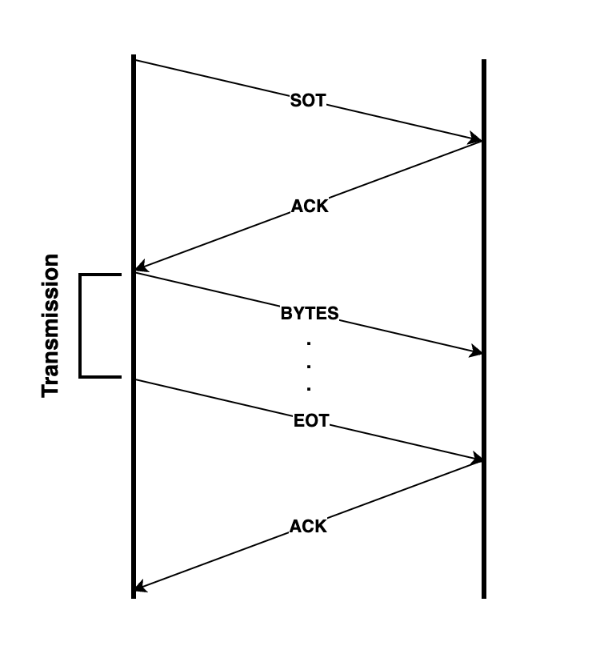

# ProtoStream

ProtoStreams allow you to **send** and **receive** large chunks of data to and from a **NetworkStream**. ProtoStreams automatically detect when the data you are trying to send won't fit in a single `1024` byte packet and will **accomodate the data to fit in a series of indexed packets** called **PacketStreams**.

When receiving data from a NetworkStream, ProtoStreams will automatically **re-assemble the data by index**. ProtoStreams automatically handle missing packets, prompting the sender to repeat their transmission.

## Members

- `_stream` - Network Stream
- `_packetStream` - [Packet](Packet.md) array
- `_lastError` - String

## Methods

### Constructors

- `Stream()`
- `Stream(NetworkStream stream)` (**recommended**)
- `Stream(Packet[] packets)`
- `Stream(Packet[] packets, NetworkStream stream)`

### Public functions

> Sending data

To transmit data over the network using **ProtoStreams** you can use the following variations of the `Transmit()` method:

- `int Transmit(byte[] data)` - Transmits a byte array over a protostream. Returns 0 on success, -1 on failure.
- `int Transmit(string stringData)` - Transmits a string over a protostream. Returns 0 on success, -1 on failure.

All of the above will take into account the precautions described in the first two paragraphs.

> Receiving data

To receive data from a **NetworkStream**, use ProtoStream's `Receive()` function:

- `int Receive()` - Receives data from the network stream. Returns 0 on success, -1 on failure.

> Assembling the data

To get the received data, it must first be re-assembled. To do this, you can call one of the following methods:

- `T GetDataAs<T>()` - Returns the assembled data as the given data type (_**for example `GetDataAs<byte[]>()`**_).

Note that, with the first method, **you must treat the byte array correctly in the context of your application**. Writting the bytes into a file for example.

> Other functions

- `bool IsConnected()` - Returns true if the peer is connected to the ProtoStream, false otherwise.

## Example

```csharp
using ProtoIP;

class Program {
      static void Main() {
            // Connect to the server
            TcpClient client = new TcpClient("1.1.1.1", 1234);
            NetworkStream stream = client.GetStream();

            // Create a new ProtoStream object
            ProtoIP.ProtoStream pStream = new ProtoStream(stream);

            // Transmit a string over the network
            pStream.Transmit("Hello World!");

            // Receive the response
            pStream.Receive();

            // Get the assembled response and show it
            string response = pStream.GetDataAs<string>();
            Console.WriteLine(response);
      }
}
```

## Specifications

ProtoStreams follow a **stand-alone protocol** to ensure the data is correctly transmitted and re-assembled by the peer. The protocol uses the default packet definitions from the ProtoIP namespace.

> This does not mean that you can't use ProtoStreams with your own protocol definitions. Checkout the [Packet](Packet.md) class for more information.

When transmitting data using ProtoStreams, the given transmission protocol takes place:

1. Peer *A* sends a `SOT` (Start Of Transmission) packet to peer *B*.
2. Peer *B* responds with a `ACK` (Acknowledgement) packet.
3. Peer *A* sends `BYTES` to peer *B* until all the packets have been transmitted.
4. Peer *A* sends an `EOT` (End Of Transmission) packet to peer *B*.
5. Peer *B* responds with a `ACK` (Acknowledgement) packet.



When receiving the data, peer *B* will notice any missing packets by checking their index, and will request the missing data from peer *A* using the `REPEAT` packet with the missing packet indexes as the packet payload.

> To ensure all the packets are accessible to peer *A* if we need to re-send the data, peer *A*'s PacketStream will only be cleared if the `ACK` packet is received after the `EOT` packet.
