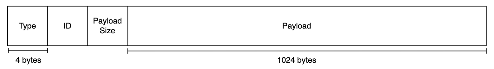

# Understanding how ProtoIP's Packet class works

## Introduction

When students get first introduced to network programming and protocols, there are a series of misconceptions that are often hard to overcome given the way subjects are taught. This tutorial aims to clarify some of these misconceptions and provide a clear guide on protocol definitions and how to use ProtoIP's Packet class.

### Common misconceptions

The most common misconceptions are derived from the abstraction point of view regarding the definitions of new protocols and the Packets internal structure itself.

When prompted to define their own communication protocols, and to describe how a system should behave, students often forget the true meaning of a protocl. The majority tends to think of a protocol as something that's inherently tied to the definition of the underlying Packet structure. Wrongly assuming that a protocol is defined by the way the data is structured inside the Packet, and that the Packet itself is the protocol.

That couldn't be further from the truth.

### What is a protocol?

Now that we got that out of the way, let's start by defining what a protocol is.

A protocol is nothing more than a set of rules and guidelines that specify how different systems or entities should interact with each other in a specific context. A protocol is not defined by the way the data is structured inside the Packet, but rather by the way the data is interpreted by the two interacting systems/entities.

This means that regardless of the way the data is structured inside the Packet, as long as the two systems/entities interpret the data in the same way and are using the same set of rules to interact with each other, they are, by definition, using the same protocol.

### When do ProtoIP's Packets come into play?

To define a network protocol, it is often useful to define a Packet structure that will be used to exchange data between the two systems/entities. This is where ProtoIP's Packet class comes into play.

The Packet class is only an abstraction for creating and manipulating "magical boxes" that carry your information over the network. It is not the protocol itself, but rather a tool that can be used to define a protocol.

For example, you can define your own packet types, let's say, a `PING` packet. In our magical network protocol we can say something like: "Every time I receive a `PING` packet, I will respond with a `PONG` packet". This is exactly what the [Client-Server](client-server.md) tutorial implements. And boom, you just defined your own protocol.

Protocols don't have to be complicated. They are only as complex as you want them to be according to the needs of your application.

### How can I use ProtoIP's Packets?

First, it is important to understand the underlying structure of a packet in ProtoIP. The class is documented in depth [here](Packet.md) if you want to take a look at the nitty-gritty details. For now we are just going to give a brief overview of the class.

A packet in ProtoIP has 4 components:

- The type of the packet
- The id of the packet
- The size of the payload
- The payload itself

#### Packet Types

The type of the packet is an integer value that can be used to identify the type of data being transmitted, or how the data should be interpreted. This is useful for defining your own protocols. For example, you can define your own packet types to follow the example given above:

```csharp
public static class PacketType
{
    public const int PING = 2;
    public const int PONG = 3;
}
```

> Keep in mind that you are not restricted in terms of what integer values you can use. Unlike ProtocolSI, ProtoIP gives you the freedom to define your own packet types. Although a series of default packet types are also defined (check [Packet](Packet.md)).

#### Packet IDs

The id of the packet is an integer value used to uniquely identify a packet in a series of packets.

Sometimes, when transmitting data, you often want to send something over the network that is many orders of magnitude larger than the maximum packet payload size of 1024 bytes. Suppose you want to send a video file over the network. That video file will have to be broken down into smaller chunks that follow the size restrictions. You would end up with a series of packets that together make up the data contained inside that video file.

For this reason, you must be able to identify the order in which the packets must be reconstructed, in order for the data to be correclty assembled. That's why every packet has it's own ID starting at 0 and incrementing by 1 for every packet sent.

You don't need to worry about this in most cases, but if you encounter a situation where you have to transmit large amounts of data, using the packet ID to uniquely identify the packets is the way to go.

Alternatively, if you don't feel like implementing all the logic that's behind such systems, ProtoIP has you covered. Take a look at [ProtoStreams](ProtoStream.md).

> ProtoStreams are the perfect example of a protocol definition using ProtoIP's packet class. ProtoStreams implement a transmission protocol that allows you to exchange large amounts of data seemlesly between two network endpoints.

#### Packet payload size

In order to send the packets over the network you must first serialize them into a byte array. The receiving end can then use that byte array to reconstruct the packet and extract the data contained inside.

Until now all of the fields explained above have a fixed size in bytes that's inherent to the actual data type itself. For example, an integer, no matter if it's a `1` or the number `99999`, will always take up 4 bytes of memory. This means that when reading the byte array on the receiving end, we can be certain that if we read the first 4 bytes of the buffer, we will have the packet type; in the next 4 we will find the packet ID; and in the next 4 the packet payload size:



The problem arises though when we want to read a field that doesn't have a fixed size; like the payload in our packet. The payload can be anything, from a single byte to the whole `1024` bytes of the maximum payload size. This is why we need to know the exact size of the payload: to be able to deserialize the packet and retrieve the data correctly.

#### Packet payload

The payload is where the actual data we want to transmit will be stored. It doesn't matter what the data type is, in fact, the Packet class doesn't "care" about that. For all it knows the payload is just a byte array.

The process of retriving the data from the payload and assembling it is up to you to define. For example we can create a packet type called `INT` where we will store an integer. In our magic protocol, we can then look at the packet type and interpret the payload accordignly: "I'm receiving a packet with type `INT` so I suppose, if the other peer is following the protocol correctly, that the payload must contain an integer value". See? That's **protocol definitions** again.

> In order for the packet size to be consistent, padding is added to the end of the payload in order to fill the entire `1024` byte buffer if the data doesn't fill it by itself. This ensures that all packets have the same size.

## Conclusion

In this article we have covered common misconceptions about protocols and how they are defined. We have also covered the basics of ProtoIP's Packet class and how it can be used to define your own protocols.

Protocols are simply a set of rules that define how a system should behave in a given context and have nothing to do with the Packet definitions themselves and how the data is structured inside them. ProtoIP's Packet class is just a tool that can be used to define protocols, but it is not a protocol by itself.

Hopefully this article has helped you understand the basics of protocols and how they are defined. If you have any questions or suggestions, feel free to reach me on Discord or submit a new issue on the GitHub repository.

***

Mon 24 Apr, 2023 - João Matos